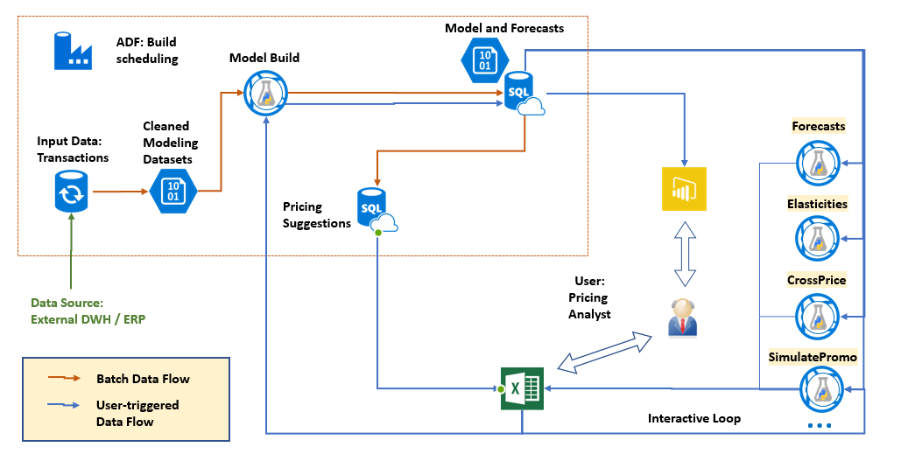
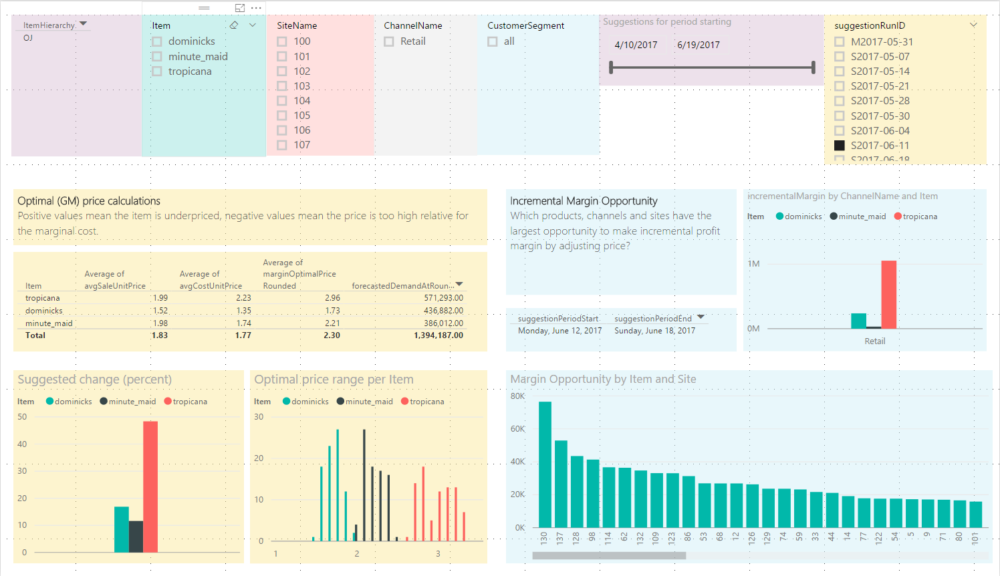

# Pricing Analytics

# Summary

The Pricing Analytics solution uses your transactional history data to show you how the demand 
for your products responds to the prices you offer, to recommend pricing changes, and allow 
you to simulate how changes in price would affect your demand, at a fine granularity.

It estimates price elasticities for every product, site, channel and customer segment
in your business. The models avoid most common confounding effects using an advanced modeling 
approach combining the strengths of machine learning and econometrics.

The solution has both visualization components (in Power BI) and interactive simulation components (in Excel).

# Description

#### Estimated Provisioning time: 20 minutes

Randomized controlled experiments are the gold standard for estimating causal effects like price elasticity of demand.
Experimentation, also known as A/B testing, is extremely difficult to set up on existing operations systems. 
Approaches using historical data are mostly “bolt-on”, but tools that guard against the many statistical pitfalls are essential.

This solution brings such tools to any business with an Azure subscription. It alleviates confounding 
by the "Double-ML" approach, which subtracts out the predictable components of price and demand variation 
before estimating the elasticity. This immunizes the estimates from most forms of seasonal confounding.
Additionally, the solution can be customized by an implementation partner to use data reflecting other 
potential external demand drivers.

Additionally, estimating demand for item, sites, and channels with sparse demand is a challenge
and pricing solutions often only give estimates at product category level. Our pricing solution
uses "hierarchical regularization" to produce consistent estimates in such data-poor situations. 
Simply put, in absence of evidence, the model borrows information from other items in the same category, 
same items in other sites, and so on. As data in an item increases, its elasticity estimate will be
fine-tuned more specifically.

This solution analyzes your prices and makes recommendations, 
* shows you in one glance how elastic your product demand is
* provides pricing recommendations for every product in your item catalog
* discovers related products (substitutes and complements
* lets you simulate promotional scenarios.

All information is provided the fine level at which you need to control your price and inventory.

More detailed description is available in our 
[blog post](https://blogs.msdn.microsoft.com/intel/archives/1015).

# Solution Architecture

The solution uses a SQL server to store your transactional data and the generated model predictions.
There are more than 10 elasticity modeling core services, which are authored in AzureML using Python core libraries.
Azure Data Factory schedules weekly model refreshes. The results display in a PowerBI dashboard.
The provided Excel spreadsheet consumes the predictive Web Services.

Please read the [Technical Deployment Guide](Technical%20Deployment%20Guide/TechnicalDeploymentGuide.md) 
for a more detailed discussion.

# Getting Started

Start by clicking Deploy on this page. Instructions at the end of the deployment will guide you further.

While the solution is deploying, get a head start and 
* peruse the [User Guide](User%20Guide/UserGuide.md) for a full set of usage instruction
* download the [interactive Excel Worksheet](https://aka.ms/pricingxls)

For technical problems or questions about deploying this solution, please post in the issues tab of the repository.

# Solution Dashboard 

The solution dashboard's most actionable tab is the Pricing Suggestion tab. It tells you which of your 
items are underpriced, overpriced, and suggests an optimal price for each item, as well as the predicted
impact of adopting the suggestion. The suggestions are prioritized by the largest opportunity to earn
incremental gross margin.

Other tabs provide supplemental information illuminating how the system arrived at the suggestions
and are discussed in more detail in the [User Guide](User%20Guide/UserGuide.md).
