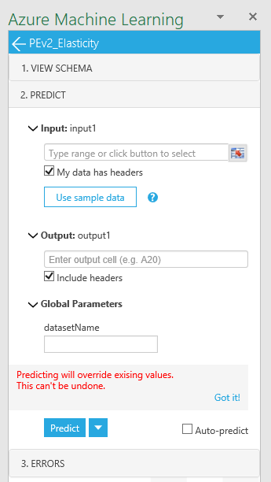
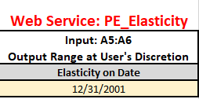
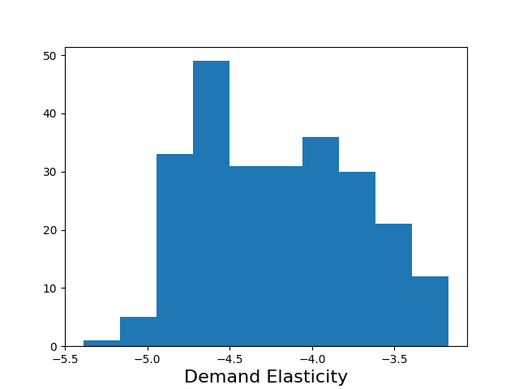

# Interactive Pricing Analytics Solution: Technical Deployment Guide

This document explains how to deploy the default configuration of the Interactive Pricing Analytics Solution.
It is intended for technical personnel who deploy the solution and connect it to the business data
warehouse.

## Outline

  1. [Introduction](#introduction)
  2. [Architecture](#architecture)
  3. [Automated Deployment Workflow](#automated-deployment-workflow)
  4. [Connecting Your Data](#connecting-your-data)  
  6. [Customization](#customization)
  6. [Building Applications](#building-applications)
  7. [Troubleshooting](#troublehooting)
  8. [Support and Feedback](#support-and-feedback)

## Introduction

The Pricing Analytics Pre-Configured Solution (PCS) consists of a set of tools 
to help set prices for wholesale and retail products based on transaction records of past sales. 
It is made up of Azure cloud and Office components.
The solution targets mid-size companies with small pricing teams who lack extensive data science
support for complex pricing models and data flows.

Please understand how the solution is intended to be used in the [User Guide](UserGuide.md).

### Suitable and unsuitable applications
We recommend this solution for retail-like contexts where each customer segment faces the same posted price. 
The customer id may or may not be known at the time of the sale. 
The solution is unsuitable when the majority of transactions have prices negotiated individually.

The accuracy of the models will be limited 
* for new products with short time series
* in scenarios where prices change due to anticipation of demand change by the seller
  which is not predictable from the data. For example, a decline in demand for 
  a device when a new version is about to be released (Osborne effect).
  Seasonal variation seen in the data, on the other hand, is modeled, given sufficient history.

## Architecture

The architecture can be summarized in the following diagram:


The solution architecture consists of the following Azure components:

* **Azure SQL DB**, used to store several different types of data, pre-process the transactional data for modeling,
  and generate pricing suggestions. A premium edition (P1) is recommended as the larger tables take advantage of clustered columnstore indices.
* **Azure Storage** account, used to save the model and intermediate data in **Blobs**.
* A model build ***AzureML web service**, running in batch mode, 
* A collection of several interactive **Azure ML services** for querying the model
* A **PowerBI dashboard**, hosted in a **Azure Web App**
* **Azure Data Factory** for scheduling regular execution

Because every business system is different, the pre-configured solution does not include data 
flows from your business system to the SQL database, or the flow of decisions pricing from 
the analyst to the business systems (e.g. ERP). 
An [integration partner](https://appsource.microsoft.com/en-us/product/cortana-intelligence/microsoft-cortana-intelligence.demand-forecasting-for-retail) 
can connect these data paths for you.

### Known limitations

The pre-configured solution necessarily makes some simplifying assumptions.
We will describe how to modify the solution below.

The known limitations are:

* We compute short-term elasticities only. In the short term, demand is less price-elastic than in the long term.
  For example, if a grocery store raises prices mildly, customers will pay the higher price, rather than driving to another store. Demand is relatively inelastic.
  In the long run, customers may choose not to come to the more expensive store in the first place and demand will fall more.
* While the model internally works with arbitrary periods, the solution has a weekly periodicity baked into 
  how the data is aggregated in pre-processing the ADF pipeline.
* We don't check any business rules, such as "the pick-up channel must be prices the same or lower as the delivery channel"
* Segmentation must be provided externally - we don't yet generate customer segments automatically

## Automated Deployment Workflow

To start, you will need an Azure subscription to which you have resource creation permissions.
A free trial subscription is sufficient for learning and experimenting with the solution.

First, go to the [CIQS solution webpage](https://aka.ms/pricingciqs) and deploy the solution.
* The name you give your solution becomes a name for the resource group for tracking your resources and spending. 
* Choose a location that is geographically to your business users.
* Click Create

The deployment goes through several provisioning and setup steps, using a combination
 of Azure Resource Manager (ARM) templates and Azure Functions. 
 ARM templates are JSON files that define the resources you need to deploy for your solution. 
 Azure Functions is a serverless compute service that enables you to run code on-demand without 
 having to explicitly provision or manage infrastructure. We will describe ARM templates and Azure 
 Functions used in this solution in later sections.

You will need to interact with the installer once, to create a user name and pasword
for the database administrator account. Remember this password well if you want to
customize the solution. If you reset it in the [Azure portal](https://portal.azure.com),
Azure Data Factory may have trouble talking to the SQL server.

### Provisioned Azure Resources
Once the solution is deployed to the subscription, you can see the services deployed by clicking the resource 
group name on the final deployment screen. 


The names of most of the resources will contain an illegible string (uniqueID) 
that makes them uniquely identifiable (which helps if you have multiple deployments).
Let us explain in detail the purpose of each Azure resource.


#### The Power BI workspace ("epbi-uniqueID")
The Power BI workspace is a container to host your Power BI dashboards in the cloud.
It starts populated with the solution dashboard. Hosting your dashboards in a workspace
enables embedding them in a Web App.

#### The Function App ("functions-uniqueID")
The Function App hosts Azure Functions, short tasks that are run after deployment, such as copying
assets into the solution storage account, populating the database with the example dataset, and 
retrieving credentials for display in the final deployment page.
The website which embeds the PowerBI workshop for display in the browser 
(<tt>pbijs</tt> and <tt>pbiweb</tt>) is also a "Function App".

#### The Hosting Plan ("hostinguniqueID")
The hosting plan is a scaling and billing layer for the web applications.

#### The Machine Learning services ("planname_PE_Servicename")
The several machine learning services are the core logic of the solution. 
They generate the elasticity models and expose all of their aspects once they are created. 
The services themselves are stateless but communicate with state written in the storage account.

#### The Machine Learning Pricing Plan ("planname_plan")
The pricing plan is how all the machine learning services get billed. 
A new S1 pricing plan is created by default. All of the ML web services share this pricing plan.

#### The SQL server ("plannamesrv")
The SQL server hosts the SQL database. SQL servers are free in Azure, usage is billed at 
database level, depending on the selected performance tier.

#### The SQL database ("pricingdemo")
The database is the main data interface between the solution and the surrounding computing
environment, hosting all the structured datasets as tables. It also performs some bulk compute tasks,
such as optimal price suggestion. A new S1 database is provisioned by default.

#### The storage account (stguniqueID)
The storage account acts most importantly as the storage layer for the pricing engine models.
It also holds the weekly run outputs from the machine learning services.
We provision a new LRS account and recommend that you turn the encryption on after deployment.

### One-time workbook setup

Next, you will configure an Excel template for interacting with the solution. 
Download the [template](https://aka.ms/pricingxls) and open it.
It has multiple tabs, each corresponding to a task in pricing analysis.

Before the sheet can be used, it must be set up by connecting the appropriate web services to the workbook.
Please connect these services by pasting their request-response URL and into the AzureML plugin.
The URLs and keys are displayed at the final CIQS page, which you can access
from the [Deployments section of CIQS](https://start.cortanaintelligence.com/Deployments).
You can also see all of your services [here](https://services.azureml.net).

Detailed connection instructions are found in the worksheet, on the "Instructions" tab.
After adding the services, save the Excel spreadsheet under an appropriate name; 
we use <tt>AnalysisTemplate.xsls</tt> and share with users in your organization.
This configured workbook template will be used to load data output from the analytical pipeline.


### Step-By-Step Visual Studio Deployment

It is possible to deploy the elements of the solution with a few clicks 
from their Visual Studio solution files, using Cloud Explorer. This requires
the full solution source code. If you are a Microsoft partner, please contact
us to arrange access for customer deployments.

## Connecting Your Data

This section describes the inputs and output datasets of the solution.

###	Input dataset

The main prerequisite is the sales history. 
The solution expects sales history data in the table <tt>dbo.pricingdata</tt>, 
with the folllowing schema:

```sql
CREATE TABLE dbo.pricingdata (	
	SalesDate		date not null,
	Item 			varchar(100) not null,
	SiteName		varchar(100) not null,
	ChannelName		varchar(100) not null,	
	ItemHierarchy		varchar(500) not null,
	UnitPrice		float not null,
	UnitCost		float null,
	Quantity		float not null,
	CustomerSegment		varchar(100) not null
)
```

The solution defines the data as an external ADF dataset, which means the data should "just appear" in this table. 
It is your responsibility to ensure that it does. We recommend that you use Azure Data Factory or SSIS to push 
sales data incrementally from the business data warehouse to this table. While transforming data, please consider
the following points.

* Data can be aggregated weekly or left in the original one-row-per-transaction state, in which case the system will be aggregate it to weekly quantities.
* If you aggregate the transactions, we recommend against defining the price as a weekly average of prices.
  Instead, we recommend you group by distinct discrete prices if possible.
* ItemHierarchy must be provided as a comma-separated list of categories, highest level first, for example "Cosmetics, Soap, Coconut Soap".
   If your items are not organized in a product hierarchy, use a single string like "Products".
* SiteName, ChannelName, CustomerSegment also must be provided, if your data does not break down along these
  dimensions, use "All" or a similar constant as well.

###	Output datasets

These four SQL tables are the output tables of the solution. You can expect them to be populated weekly.
They underlie the Solution dashboard and can be used to create other visuals as well.

* Elasticities
* Cross-elasticities
* Forecasts
* SuggestionRuns

#### Common columns and conventions

Current run outputs are appended to these tables.

Each has a RunDate column, corresponding to the date on which the data was inserted. 
The RelationValidDate column refers to the time for which the value of elasticity or demand was measured.
For example, one might run the model on Jun 30, 2017 and obtain estimates for all times in the history.
Then Rundate ='2017-06-30' and there will be a number of RelationValidDates, one for each historical periods.

All tables have columns named Item, SiteName, ChannelName, and CustomerSegment, identifying
the specific individually priced SKU for which the estimate or prediction is given.

Where columns named &lt;Measure&gt;90LB and &lt;Measure&gt;90UB appear, this is the 90-percent confidence
interval around the estimate.

#### Elasticities dataset

```sql
CREATE TABLE dbo.Elasticities (	
  RunDate               date not null,
  RelationValidDate     date null,
  Item                  varchar(100) not null,
  SiteName              varchar(100) not null,
  ChannelName           varchar(100) not null,	
  CustomerSegment       varchar(100) not null,	
  Elasticity            float not null,
  Elasticity90LB        float not null,
  Elasticity90UB        float not null,
)
```

#### Cross-Elasticities dataset
The Cross-Elasticities table stores all the cross-elasticities that were estimated.

```sql
CREATE TABLE dbo.CrossElasticities (	
  RunDate               date not null,
  RelationValidDate     date null,
  CustomerSegment       varchar(100) not null,	
  DrivingItemKey        varchar(100) not null,
  DrivingSiteName       varchar(100) not null,
  DrivingChannelName    varchar(100) not null,	
  ImpactedItemKey       varchar(100) not null,
  ImpactedSiteName      varchar(100) not null,
  ImpactedChannelName   varchar(100) not null,	   
  CrossElasticity       float not null,
)
```

There are two sets of items, prefixed with Driving and Impacted, since cross-elasticity
is a directional relation. The measurement is in the CrossElasticity column.


#### Forecasts dataset
The Forecasts table stores all the forecasts the model has made.
RunDate doubles as an identifier of the forecast run.

```sql
CREATE TABLE dbo.Forecasts (	
 RunDate               date not null,
  Source				varchar(100) not null,	-- where did the forecast come from?
  Item                  varchar(100) not null,
  SiteName              varchar(100) not null,
  ChannelName           varchar(100) not null,
  CustomerSegment       varchar(100) not null,
  LastDayOfData         date not null,  -- forecast made using data up and including this  
  PeriodInDays          int not null,
  PeriodsAhead          int not null,
  ForecastPeriodStart   date not null,
  ForecastPeriodEnd     date not null,  -- end of the period whose demand is forecasted
  UnitPrice             float,           -- forecast is conditional on this price. 
  Demand                float not null,
  Demand90LB            float not null,
  Demand90UB            float not null,
  ActualSales           float null,
  sAPE                  float null,
  qBar                  float null
  primary key (RunDate, Item, SiteName, ChannelName, 
                LastDayOfData, ForecastPeriodStart, ForecastPeriodEnd)
)
```

LastDayOfData is the last day of data available at the time that this forecast is made.
PeriodInDays makes it clear how many days there are in the forecast period.
PeriodsAhead is how many periods ahead we are forecasting.
ForecastPeriodStart and ForecastPeriodEnd denote the date range in which the predicted Demand is to be realized.
The measurement is in the Demand column.
If the forecast is made for a period in the past, the ActualSales are known, 
and the Symmetrics Average Percentage Error (sAPE) is calculated.
To put the sAPE in perspective, the qBar is a smoothed measure demand around the forecast period.

#### Suggestions dataset

The SuggestionRuns table stores the pricing suggestions made from
the elasticities and forecasts. 

```sql
CREATE TABLE [dbo].[SuggestionRuns] (
    [suggestionRunID]            VARCHAR (200) NOT NULL,
    [pastPeriodStart]            DATE          NOT NULL,
    [pastPeriodEnd]              DATE          NOT NULL,
    [suggestionPeriodStart]      DATE          NOT NULL,
    [suggestionPeriodEnd]        DATE          NOT NULL,
    [minOrders]                  FLOAT (53)    NOT NULL,
    [Item]                       VARCHAR (100) NOT NULL,
    [SiteName]                   VARCHAR (100) NOT NULL,
    [ChannelName]                VARCHAR (100) NOT NULL,
    [CustomerSegment]            VARCHAR (100) NOT NULL,
    [UnitsLastPeriod]            FLOAT (53)    NULL,
    [avgSaleUnitPrice]           FLOAT (53)    NULL,
    [avgCostUnitPrice]           FLOAT (53)    NULL,
    [Orders]                     INT           NULL,
    [RevenueLastPeriod]          FLOAT (53)    NULL,
    [MarginLastPeriod]           FLOAT (53)    NULL,
    [Elasticity]                 FLOAT (53)    NOT NULL,
    [marginOptimalPrice]         FLOAT (53)    NULL,
    [marginOptimalPriceRounded]  FLOAT (53)    NULL,
    [percentChange]              FLOAT (53)    NULL,
    [forecastedDemandAtOptimum]  FLOAT (53)    NULL,
    [forecastedDemandAtRounded]  FLOAT (53)    NULL,
    [forecastedRevenueAtRounded] FLOAT (53)    NULL,
    [forecastedMarginAtRounded]  FLOAT (53)    NULL,
    [incrementalMargin]          FLOAT (53)    NULL
);
```

The suggestionRunID is an identifier referring to the date of model 
build from which the suggestion are created.

<tt>PastPeriodStart</tt> and <tt>PastPeriodEnd</tt> describe the time interval for which
the baseline numbers (Orders, Revenue, Margin) are taken (the "past period").
<tt>SuggestionPeriodStar</tt> and <tt>SuggestionPeriodEnd</tt> describe the period for
which the price is proposed (the "suggestion period").
<tt>minOrders</tt> is the minimum number of orders that need to have occured
for the item in the past period to be considered in the suggestion pipeline.

Then we have the baseline numbers: <tt>UnitsLastPeriod</tt>, <tt>avgSaleUnitPrice</tt>,
<tt>avgCostUnitPrice</tt>, <tt>RevenueLastPeriod</tt>, <tt>MarginLastPeriod</tt> 
whose interpretations are hopefully clear. 
<tt>Orders</tt> will be more than 1 only if disaggregated data are entered.

<tt>Elasticity</tt> comes from the model estimatuon step, and the optimal prices
follow from it and the marginal cost (avgCostUnitPrice). The exact price maximizing
the gross profit margin is <tt>marginOptimalPrice</tt>, which is then rounded to
"x.y9". The model predicts that it should be possible to make additional 
<tt>incrementalMargin</tt> dollars over the suggestion period. 

## Configuration

To set the parameters, update the table <tt>dbo.Parameters</tt> in the Solution's 
SQL database, which stores simple key-value pairs:

```sql 
CREATE TABLE [dbo].[Parameters] (
    [paramName] VARCHAR(50) NOT NULL, 
    [paramValue] VARCHAR(MAX) NULL, 
    PRIMARY KEY ([paramName]) 
)
```

The bulk services are the only ML Services running in the ADF
pipeline and therefore need configuration.

### Recognized parameters for bulk services

|Parameter (paramName) | Meaning | Default paramValue |
|--|--|--|
|BulkElasticities_DeltaX    | Elasticity for what change in price*?     | -0.1 |
|BulkElasticities_WeekJump  | Retrieve elasticity for every n-th week   | 1 |
|BulkForecasts_periodsAhead | Forecasts for many periods ahead?         | 1 |
|BulkCrossPrice_WeekJump    |Retrieve elasticity for every n-th week    | 1 |

### Adjusting suggestion lead times

Today, you can adjust the lead times on suggestion by manipulating the date parameters 
which Azure Data Factory passes to the <tt>spRecommendProducts</tt> stored procedure Activity
(see ADF description below). If you would like multiple suggestion periods, please
duplicate the stored procedure activity and call it with different parameters.

```json
"typeProperties": {
    "storedProcedureName": "spRecommendProducts",
    "storedProcedureParameters": {
    "SliceEnd": "$$Text.Format('{0:yyyy-MM-dd}', SliceEnd)",
    "lastDayOfData": "$$Text.Format('{0:yyyy-MM-dd}', SliceEnd)",
    "suggestionPeriodStart": "$$Text.Format('{0:yyyy-MM-dd}', Date.AddDays(SliceEnd,1))",
    "suggestionPeriodEnd": "$$Text.Format('{0:yyyy-MM-dd}', Date.AddDays(SliceEnd,7))",
    "minOrders": "1"
}
```

## Building Applications

While many users find the Excel environment natural, many will also require features
that are not directly supported by our core models and pipelines. BI Applications
will necessitate ETL jobs sending the data to other applications.

First, we will address the case of integrating the services into an application.
Whether you are building a customer-specific user interface in Excel or another application, 
you will want to call the web services. We first give an detailing example of calling the 
Elasticity web service from Excel and describe its inputs and outputs. 
The other services operate analogously.

Then we will describe the ADF pipeline and the datasets in the storage account;
it should help you consume the output in custom BI applications.

### Elasticity service from Excel
You can inspect the elasticities of every product by navigating to the "Elasticities" tab of the
Promotion Suggestion report and opening the "Elasticity" service pane of the AzureML plugin.

 {style = "width: 300px"}

Because elasticities can change in time, a query date is required in cell A6 of the spreadsheet.
We recommend using the date of the most recent model. The A5:A6 range of cells is the input.



The output location should be set to a convenient location in the spreadsheet, normally Elasticities$A20.
The "datasetName" parameter is of the form "M<date>", where data refers to the day on which the model
was created, using data available up to that day. You can explore previous models as well
[Future pointer: we should offer the "list models" feature and if model isn't listed, use latest]

The output consists of a dataframe containing the estimated elasticity of every Item at every
Site, as well as the 90% confidence interval for the estimate. The range of elasticities can
be seen in one glance by clicking on the generated external figure link containing the elasticity histogram.



To get the service to behave as if it was a first-order Excel function and update
values in its output cells every time the input changes, check the Auto-predict box.

### Calling REST APIs from anywhere

The services are simply AzureML RESTful APIs. You can go to (https://services.azureml.net)
to grab sample code to consume them from R, Python, or C#. 

See the swagger documentation to the services to understand their input and output requirements.
The same information is reflected in the VIEW SCHEMA pane of the AzureML plugin.

### Individual Services Descriptions

There are three types of ML service in this solution, batch model build, interactive retrieval 
and bulk retrieval services. 

The batch model build service is BuildModel and is responsible for all estimation 
and forecasting tasks. Depending on data size, it can run several minutes to hours.

The interactive services are:
* Elasticities - retrieve elasticities for one product at all sites, channels, and segments
* CrossElasticities - retrieve cross-elasticities for all products and channels at one site. 
                        The model assumes the same items at different sites don't compete.
                        Perhaps more questionably, it also assumes that customer segmentation
                        boundaries are not permeable.
* Forecasts - retrieve forecasts at one site, assa specific pricing point
* PromoSimulation
* Outliers
* RetrospectiveAnalysis

These services are expected to return within a few seconds (the first query after a while may be slow
as the containers "warm up").

The bulk services are used to export the data from the model to the database.
* BulkElasticities
* BulkCrossElasticities
* BulkForecasts

### Storage and ADF structure

The Azure Data Factory has three Pipelines:
- Configure Services Pipeline. This creates small datasets containing solution parameters.
- Pricing  This is the large pipeline which 
- * Prepares the data for modeling
  * Runs the models
  * Extracts forecasts and elasticities from the model
  * Loads the model outputs into the database for visualization
- Suggestions Pipeline creates pricing suggestions based on outputs of the Pricing pipeline.

<div class="todo" style="color:red; font-weight: bold;">
TODO: describe activities in the pipelines
</div>

The storage account has the following important folders:
- crosselasticity - extracted from the model in Pricing Pipeline
- elasticity - extracted from the model in Pricing Pipeline
- experimentoutput - AzureML experiment internal cache
- forecasts - extracted from the model in Pricing Pipeline
- originaldata - cleaned, processed input data at start of Pricing Pipeline
- pricing - contains the log files from model runs
- serviceparameters - parameter datasets produced by the Configure Services pipeline


## Troubleshooting

Most of the trouble we experienced has to do with needing to scale up.
The solution is deployed at minimal performance and cost levels, and larger datasets may
need to use higher tiers of the resources.

#### "Blob does not exist" errors
The blob name is crezted from the datasetName given in the spreadsheet.
Open the storage account and make sure a model with the given datasetName exists. 
The name is case-sensitive.
The default datasetName used by ADF is "latestDemoBuild".

#### Timeouts on the BuildModel service
Try increasing the timeout period in the <tt>retrain_AzureML_Model</tt> ADF activity.

### Database or dashboard slow
If you are experiencing performance issues with the database, try using a Premium database.
Since the dashboard is direct-query, performance issues with the dashboard are often
also database throughput issues.

## Support and feedback

Please contact Tomas.Singliar@microsoft.com with questions, requests or concerns about the solution.
