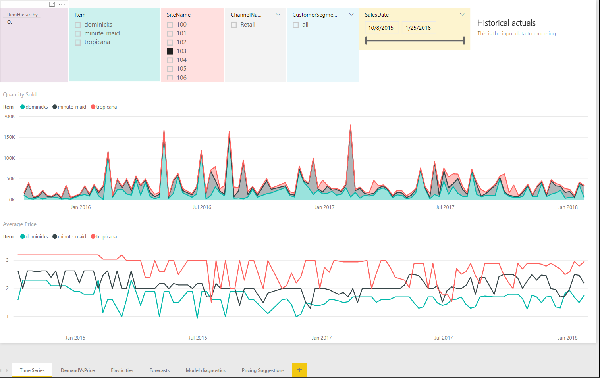
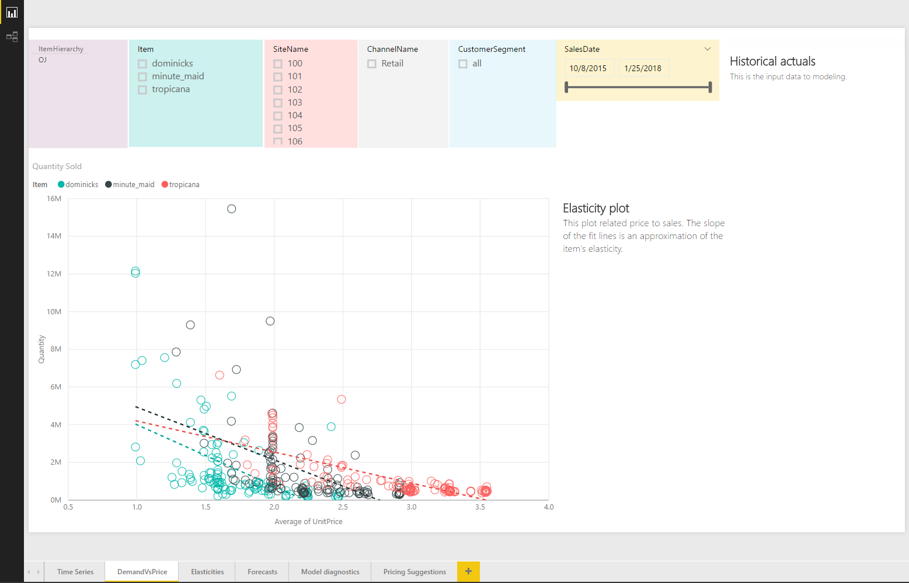
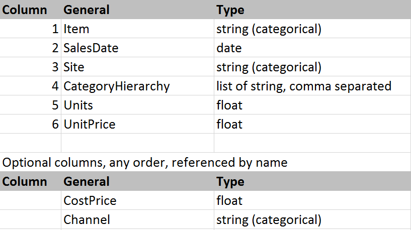
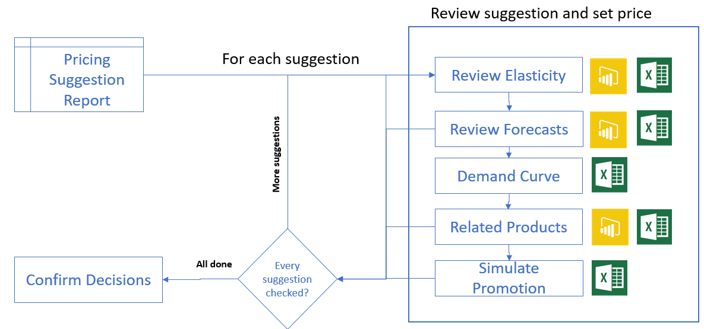
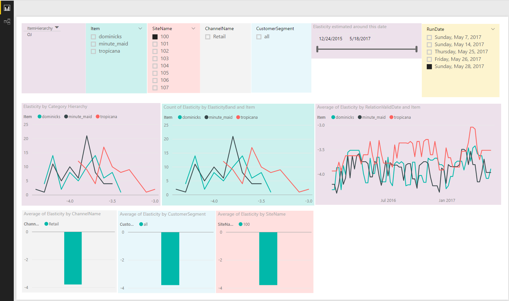
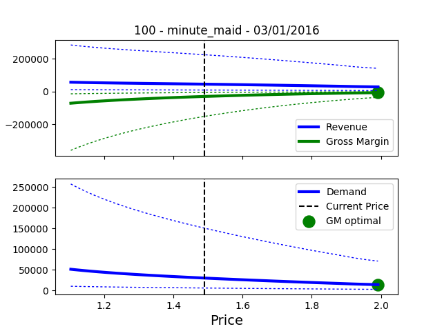
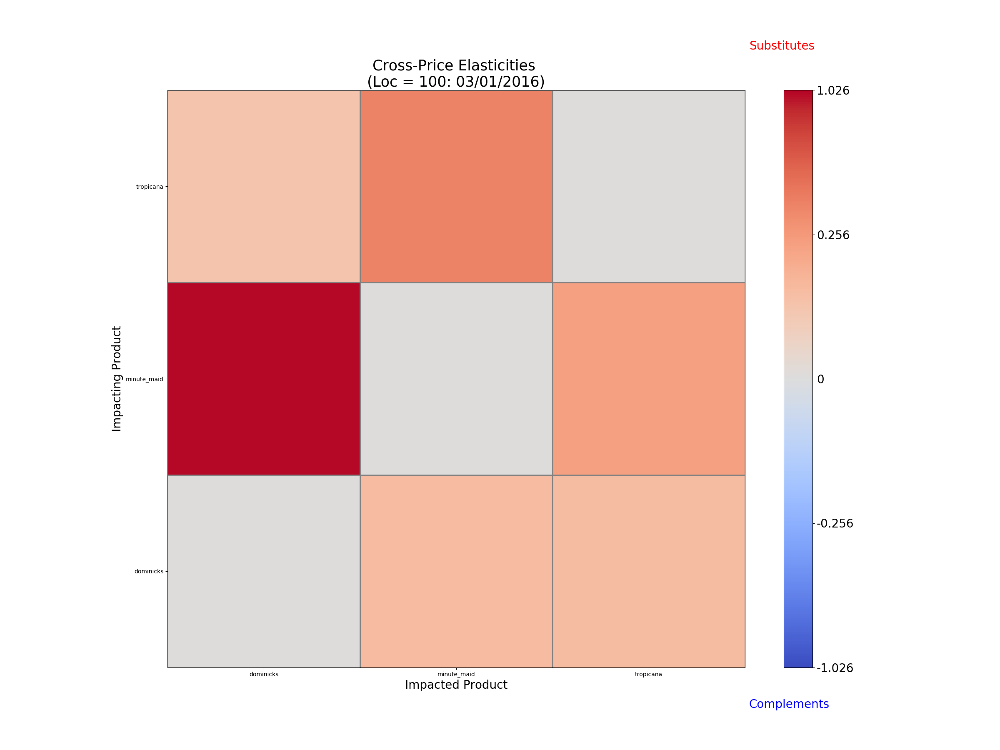
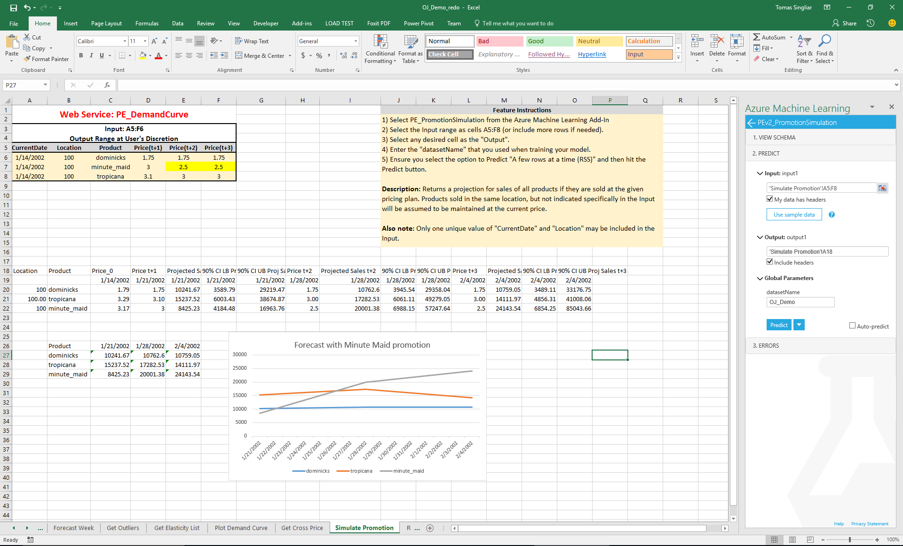
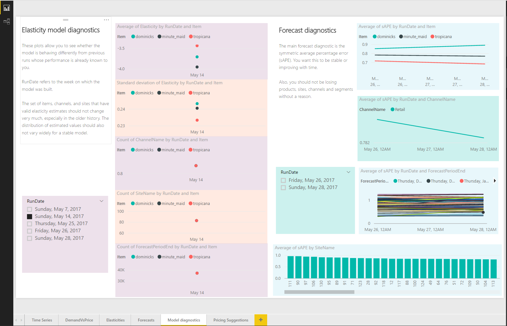

# Pricing Analytics Pre-Configured Solution: User Guide

This document is intended for the end user of the solution. It will guide you through
the use of the solution in its default configuration. 

## Table of Contents

1. [Introduction](#introduction)
2. [Automated Installation](#automated-installation)
3. [Economic Foundations](#economic-foundations)
4. [Using the Pricing Engine](#using-the-pricing-engine)
5. [Monitoring the Pricing Engine](#monitoring-the-pricing-engine)
6. [Glossary](#glossary)
7. [References](#references)

## Introduction

The Pricing Analytics Pre-Configured Solution (PCS) is an Azure Cloud solution consisting of a set of 
tools to help set prices for wholesale and retail products based on transaction records of past sales. 
It is targeted at mid-size companies with small pricing teams who lack extensive data science support for 
sophiticated pricing models.

This document explains how to install the solution in your Azure subscription, load your transaction data in it, 
and run the tools from your desktop using Excel, to generate prices, e.g. for a monthly promotion, and predict
the effect of these prices on sales and revenue. 

This document also explains the pricing theory behind the tools, documents the solution architecture, and shows
how to use the solution. The [Technical Deployment Guide](Technical%20Deployment%20Guide.md) 
goes into more detail about how to integrate the solution with your cloud or on-premise data. 

## Automated Installation 

A "solution" refers to an assembly of Azure resources, such as predictive services, cloud storage an so on, 
that consitute an application. There is an entry in the [Cortana Intelligency Gallery](https://gallery.cortanaintelligence.com/) that has a single-button install for this solution. 
To deploy the solution, go to its [Cortana Intelligence web page](https://start.cortanaintelligence.com/Deployments/new/msr-pricing-class) and click Deploy.

Assuming you've already set up an Azure subscription, this will place a copy of the resources there.
Please follow the installation instructions for any manual steps needed.
Take note of the final page of the CIQS deployment, listing names of resources deployed. 
It will help you find resources like "the storage account". 
The final deployment page is always available in your [CIQS deployments](https://start.cortanaintelligence.com/Deployments).

In addition, System Integrators and ISVs will be able to customize the PCS to build specific pricing decision 
support applications on Azure for their clients' specific needs. 

### One-time workbook setup

We provide an Excel template for interacting with the elasticity models. 
It has multiple tabs for the different steps in pricing analysis.
Before the sheet can be used, it must be set up by connecting the appropriate web services to the workbook.
Please connect these services by going to https://services.azureml.net 
and pasting the request-response URL into the AzureML plugin after clicking "Add".

Detailed connection instructions are found in the worksheet, on the "Instructions" tab.
After adding the services, save the Excel spreadsheet under an appropriate name; 
we use <tt>AnalysisTemplate.xsls</tt>.
This configured workbook template will be used to load data output from the analytical pipeline.

## Economic Foundations

The Pricing Analytics PCS is an economical, full-featured application driven by the sales transaction history
of your business. It discovers products whose prices deviate from optimum and suggests pricing promotions for
sets of related products. A pricing manager can
examine sales predictions (as forecasts, demand curves, and cross-product effects) as a function of
recommended price changes, then track the effect of the pricing changes over time on a dashboard.

Pricing is a core business function for every single company. 
Yet, there are no one-size-fits-all solutions because every business has a unique history and position in the market. 
Enormous human, marketing and technical resources are spent on getting pricing right. 
Today price setting is informed by a combination of experience of long-time employees, competitive market intelligence, 
experiments and promotions, and supplier forecasts.

Given the abundance of historical data, pricing seems ripe for the application of machine learning. 
However, there are many confounding effects like holidays and promotions. 
Machine learning tradition prioritizes prediction performance over causal consistency, but pricing decisions 
need high-quality inference about causation. Causation is most reliably established using randomized controlled experiments,
but experimentation, also known as A/B testing, is extremely difficult to set up on existing operations systems. 
Observational approaches do not require infrastructural changes, but tools that guard against the many statistical pitfalls are essential.

The pricing solution implements an advanced observational approach to factor out the effect of known confounding factors.

### Core concept: Elasticity

The core concept is that of price elasticity of demand, a measure of how sensitive the aggregate demand is to price.

Informally, self-price elasticity is the percentage "lift" in sales of a product if we put it on a 1% discount.librar
Most consumer products have elasticities in the range of 1.5-5. 
Products with more competitors are easier to substitute away from and will have higher elasticity. 
Discretionary products are more elastic than staples.

The above condition holds if you are optimizing only revenue, which is the case if you have negligible marginal cost 
(e.g. you sell electronic media). More frequently, you have substantial marginal costs, 
and want to optimize your gross margin (price - marginal cost). 
Then the constant -1 in the above calculation is replaced by (Price)/(Gross Margin), also known as the inverse Lerner Index. 
For example, suppose your marginal cost of oranges is $4 and you are selling them for $5. 
Then you should increase prices at lower elasticities (e > -5), and decrease them otherwise. 

This PCS includes a model that computes an elasticity for each combination of (Item, Location, Channel).

## Using the Pricing Engine

Once you've installed the Solution on Azure you work with it from a PowerBI Dashboard and 
a set of Excel spreadsheets.

In this Section, we describe how the solution helps you
* see your data
* build pricing models on schedule or interactively
* review pricing recommendations and set prices
* view promotion impacts in terms of additional sales and margins

### Seeing your data

Even before you begin to analyze your data, it may be useful to simply look at it.
The solution dashboard contains two panes for descriptive analysis.

The Time Series tab allows you to see the data in time, filtering down to products,
sites, channel, segments and time periods.
* Actual sales time series, filterable by category hierarchy, site, and channel

The DemandVsPrice tab shows the simplest possible (and inaccurate) method of estimating price elasticity.
We plot demand versus price and obtain downward sloping lines expressing how demand decreases with
increasing price. Again, the full complement of filters is available.

### Building a model from data

First, we need to build a model from transactional data.

Out-of-the-box, the solution database is pre-populated with the demonstration dataset (Orange Juice) 
with dates shifted to create a realistic appearance of data coming in weekly. 
The pre-configured model is automatically re-built weekly from the current data.

When the implementor connects the solution to your business data warehouse, data updates 
per that ETL job (whether it is [SSIS](https://docs.microsoft.com/en-us/sql/integration-services/sql-server-integration-services), 
[ADF](https://azure.microsoft.com/en-us/services/data-factory/) or some other method).

The solution allows you to build a model without a full integration from the Excel workbook.
You need to prepare your data in the same format as the OJ data given as an example.
Please follow this schema:

{style="width:400px"}

Navigate to the AzureML plugin and find the service with "BuildModel" in its name.
(If you don't have a BuildModel service connected, please connect the service per the Instructions tab of the workbook).

Now, select all of your data, including headers, and click “Predict as Batch” in the AzureML plugin window. 
On OJ data, this will take about 3 minutes to output the products, locations and date ranges the engine recognizes. 
The output should look like this.

We named our model OJ_Demo. You can build models from many datasets, 
just give them different names to avoid overwriting any models you want to keep around.

### Workflow: Price Review and Setting

Now that our model is built, we get to the main function of the solution, 
which is to enable a pricing manager to optimize prices offered.
The wokflow starts with the Pricing Suggestion worksheet. 
Every row in the worksheet is a pricing suggestion. 
You review all the items on that report, checking the PowerBi dashboard 
or interrogating the model through Excel if you need more detail on that item.
For each item whose price you decide to change, you enter the new price.
When done, you use the Upload service to let the system know to start tracking the impact
of the price change. Here is the workflow in a picture.

* review overpriced/underpriced items report and suggested prices 
* visualize the demand curves
* review elasticities and cross-products effects: substitute and complementary products
* simulate the effect of changing prices for individual products on revenue and margin
* record the setting of the new prices

#### Pricing Suggestions

Pricing suggestions are directly exposed in the solution dashboard.

#### Review elasticities 

It may be difficult to trust an opaque model to make a good suggestion if it doesn't expose the basis of its prediction.
The basis for pricing prediction is the elasticity value for each product.

The easiest way of seeing the estimated elasticities is to look at the solution dashboard,
the Elasticities tab.

On this tab you can see the distributions of elasticities. For example, you can see that
Tropicana juice (red) is the least elastic. The distribution of estimated Tropicana elasticities
(over sites, channel, etc.) is centered aournd -3.5, with two peaks around -3.4 and -3.7.
Elasticities of Dominick's and Minute Maid juices have very similar distribution, and both are
more elastic products than Tropicana. This corresponds nicely to the slopes of the lines on
the Demand vs Price tab, and to the fact of Tropicana being the most desirable of the products.

Over time the estimated elasticities have fluctuated but the overall picture of higher
elasticity of Tropicana and lower ones for Minute Maid and Dominick's hold. 

Note we have filtered down to only the elasticities estimated in the latest model run (Sunday May 28th).
Each model run estimated elasticities from the entire history up to and including the model run date.
With long histories, models tend to be stable: if you click through the model runs, the results are very similar. 

You can also query the elasticities using the Excel service GetElasticities.
With this service, you can query the latest model build (use "latestModelBuild" for datasetName).
Because elasticities can change in time, a query date is required in cell A6 of the spreadsheet.

The output consists of a dataframe containing the estimated elasticity of every Item at every
Site, as well as the 90% confidence interval for the estimate. The range of elasticities can
be seen in one glance by clicking on the generated external figure link containing the elasticity histogram.

Elasticities in the negative-single-digit range are expected. Elasticities much below -10 are a cause
for suspicion. Elasticities above zero point to the model not capturing a strong confounding effect.
Please review your business with a statistician if you get elasticities above zero (we can help).

#### Visualize the Demand Curve

Demand Curve visualization is available as an Excel service only.
You invoke the DemandCurve AzureML service from the Demand Curve tab of the spreadsheet.

The service gives you the estimated quantity and gross margin of a single product 
sold over a range of price points for the product. 
The inputs identifying the product are are Location, Product, Channel, Segment.
Date and Marginal Cost are also inputs; Date identifies at which point in time the 
forecast should be made using elasticity valid around that time. Marginal cost is
needed to calculate the gross margin.

The curve is visualized in the linked picture provided in the last column:

The blue curve is the estimated revenue, the green curve is the gross margin (GM).
In this particular illustration, the GM optimal point is all the way out at the top
end of the considered range. Note that the current price at this date is much lower than 
typical for Minute Maid ($2.39) and the model is pushing for a higher price.

The Excel tabular output lets you see the predicted number more precisely 
and use the them in your Excel calculations.

#### Cross-price elasticities

Cross-price elasticities indicate how price of one product affects sales of other products.
For instance, if the cross-price-elasticity of demand for peanut butter (impacted product) 
with respect to price of jelly (impacting product) is -3, you can expect a 3% increase of
demand for peanut butter if you lower the price of jelly by 1%. 

When deciding on the price of a product, the purpose of finding the related products
is to select which other products to include in the "promotion simulation" step.

The cross-elasticities can be seen on the solution dashboard's Related Products tab.

In Excel, you use the cross-price elasticity service similarly to the elasticity service,
specifying a date, and location at which to look for cross-price effects.
In Excel, the output is a data frame for your inspection and graphing, and an at-a-glance matrix
of cross-elasticities. In our Orange Juice example, we see that all products are substitutes
with positive cross-elasticities, and none are complements with negative ones. 
The strongest effect we see is Minute Maid on Dominicks, meaning that lowering
the price of Minute Maid eats into sales of Dominicks, whereas the converse effect
is weaker.

 {style="width: 400px"}

We currently assume there is no effect across sites and channels.

#### Simulating the effect of a promotion

Before making a final pricing decision, many pricing managers will desire 
to review the predicted effect of a price change, comprehensively across products.
This interactive feature is available only in Excel because it requires the user to 
input a hypothetical promotional scenario (entering data is awkward in PowerBI).

In this simulation, we are at the end of week of 1/14 and we look at the predicted effect 
of setting the price  of Minute Maid to $1.75 for two weeks (beginning at the week of 1/28)
at location 100. We can see a major increase of Minute Maid demand in week 1 of the  promotion
and a further increase in week 2 (this is consistent with the anecdote we heard from pricing
managers in distribution that it takes a week or so for people to really notice a promotion).
Note how the seasonal trend in Tropicana demand is bent down by the promotion in Minute Maid
as people substitute to the brand on sale.

This analysis lets you look at the effect of a promotion more holistically.

Each promotion run has a SuggestionRunID, which identifies a promotion.

## Monitoring the Pricing Engine

Well understood and stable model performance reduces uncertainty for decision makers. 
The following dashboards and services provide visibility into the model operation.

### Workflow: Monitor model accuracy

These solution features are intended to expose model perfomance metrics and ensure that
the accuracy you are accustomed to is not fluctuating.

At-a-glance view of the model performance is available in the "Model Diagnostics"
dahsboard tab.

There are two sections, the Elasticity model and the Forecast model diagnostics.

For the Elasticity section, we show the estimated values. On average, these
should not move very much for any of the sites, products or items. 
You are looking for a stable performance across model runs.

For forecasts, we are showing the symmetric APE as the main performance metric,
again dis-aggregated by item, site, channel, etc.

There are two Excel services allow you to pinpoint items where the model may be particularly
far off target. Fundamentally, they look for bad forecast failures.
You should be extra careful using the results for these items.

### Finding Outliers

This service gives the items which have much higher error than most, it shows how many
standard deviations these forecasts were off.

### Retrospective Analysis

This service displays the failed forecasts on a time axis to allows you to see if forecast 
failure for individual outliers might be related to exceptional demand events.
ounterfactual is visualized as trend line.

## Glossary

* Item: The SKU being sold. We may refer to it as ItemKey when it is not obvious whether we are talking
        about a product in general (say, identified by a UPC code) or a product being sold at a place, 
        time, and method. 
* Site: A store or a warehouse where the demand is fulfilled.
* Channel: Sales channel, for instance In-Store sales vs Internet shipping order. Prices may differ by channel.
* Customer Segment: is distinct from Channel, but may be correlated, or usage of the sales channel may be
                  a means of price discrimination. A typical segmentation might be on "UsedCouponX",
                  with prices differing for different coupon types.

## References

1. [Blog post on an early version of the Pricing Engine](https://blogs.msdn.microsoft.com/intel/archives/1015)
2. [Wikipedia: Price Elasticity of Demand](https://en.wikipedia.org/wiki/Price_elasticity_of_demand)]